🚀 Projet Nginx & MySQL avec Vagrant

#   Description

Ce projet utilise Vagrant pour configurer un environnement de développement avec :

    Un serveur web Nginx
    Un serveur MySQL
    Une mini application front
#   Prérequis

    Vagrant
    VirtualBox

1. Initialisation et configuration de Vagrant

```bash
vagrant init
```
📝 Cela génère un fichier Vagrantfile de configuration.

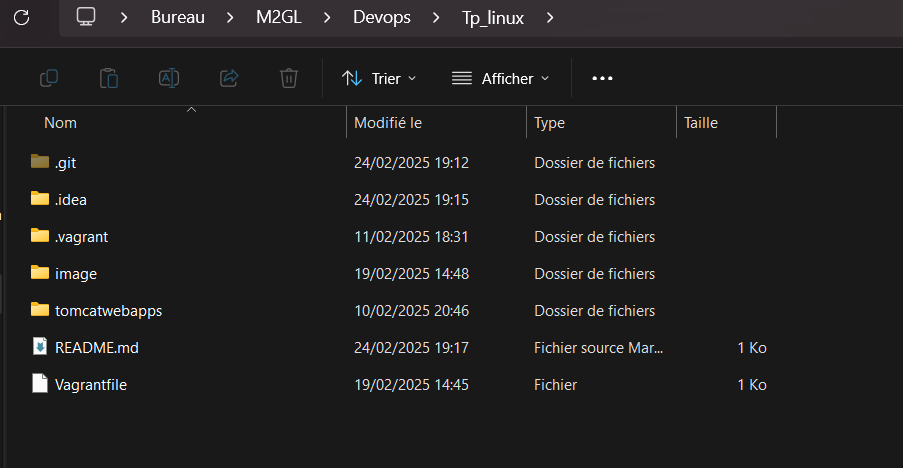

⚙ Configuration du Vagrantfile

Modifiez le fichier Vagrantfile pour définir la machine virtuelle souhaitée sur VSCode ou votre éditeur préféré.
Choisissez une box : Visitez Vagrant Cloud et sélectionnez bento/ubuntu-22.04.

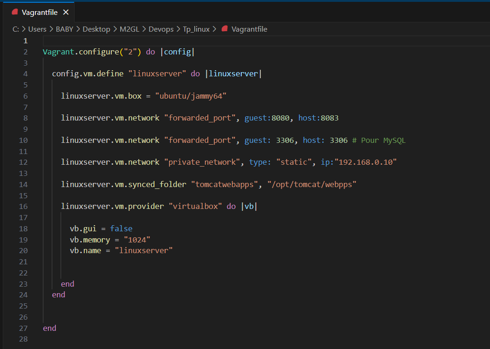

✅Validation et Démarrage de la VM

Après avoir configuré le Vagrantfile, vous pouvez valider la configuration avec cette commande pour vérifier si la configuration est correcte.

1️⃣ Validez votre configuration

Cette commande permet de vérifier si la configuration est correcte :

```bash
vagrant validate
```
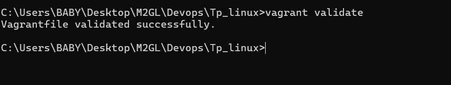

2️⃣ Démarrez la machine virtuelle

```bash
vagrant up
```
💡 Cela lance la VM.

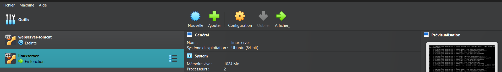

3️⃣ Accédez à la VM via SSH

```bash
vagrant ssh
```
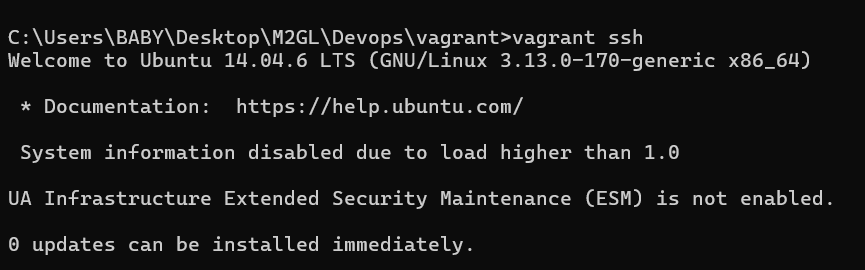

4. Installer les packages:

Mets à jour les paquets de la VM :

```bash
sudo apt update && sudo apt upgrade -y
```
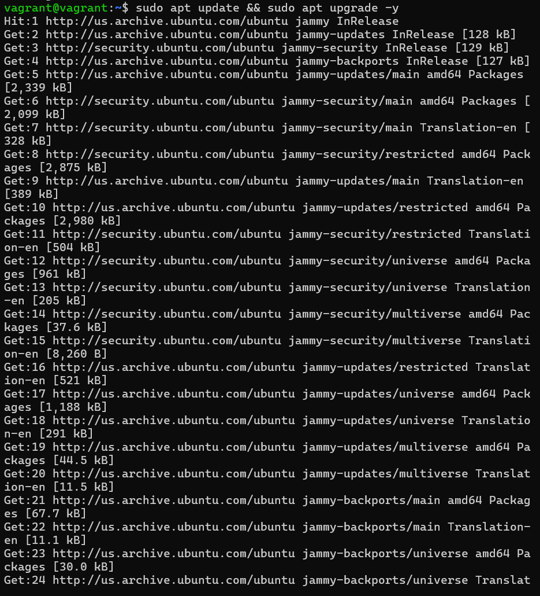

5. Installer NGINX

Maintenant installez Nginx sur Ubuntu:

```bash
sudo apt install nginx -y
```
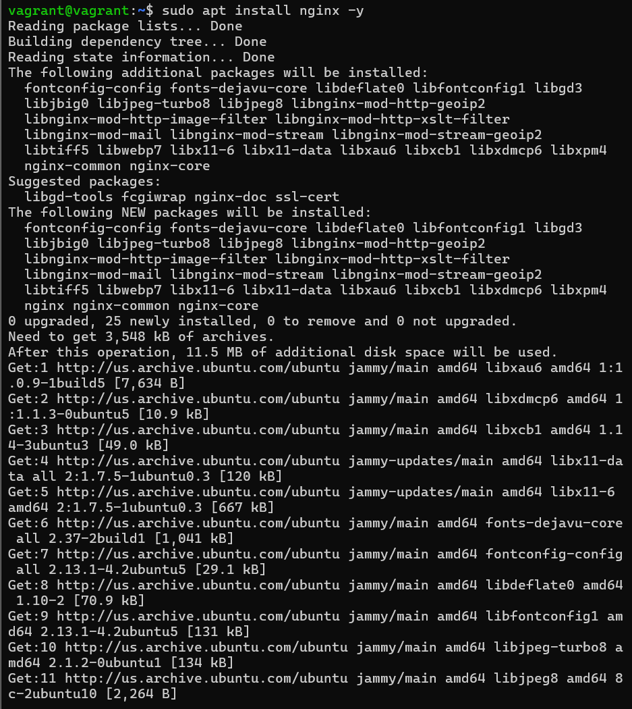

5. ✅ Vérification de l'installation

Vérifier que Nginx est installé et actif:

```bash
systemctl service nginx start
systemctl service nginx status

```
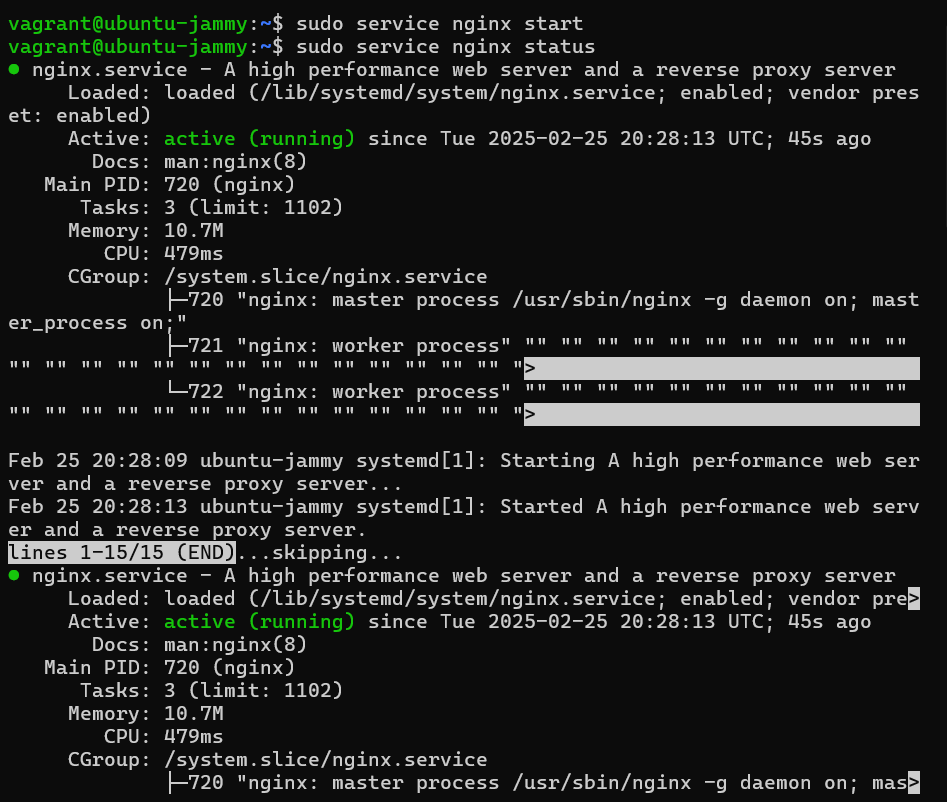

Donc : Si Nginx est actif, tu verras un message indiquant "active (running)

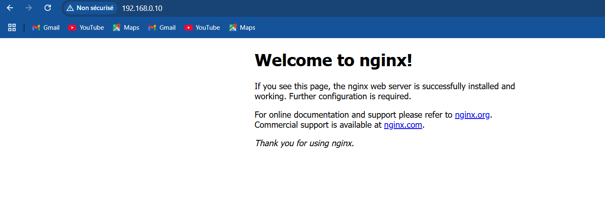

6. Déploiement de l'application

Crer un dossier mini-app et y placer votre index.html vers le chemin /var/www/html/

```bash
sudo mkdir -p /var/www/html/mini-app
nano /var/www/html/mini-app/index.html
sudo ln -s /etc/nginx/sites-available/mini-app /etc/nginx/sites-enabled
```

Ensuite on ajoute le site dans les site-enabled

```bash
sudo ln -s /etc/nginx/sites-available/mini-app /etc/nginx/sites-enabled

```
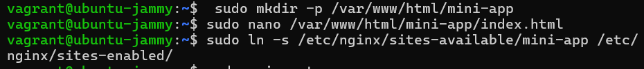

Prenez l'adresse ip de votre app

📌 Adresse IP de l'application : 192.168.0.10

👉 Ouvre ton navigateur et entre l’URL suivante : http://192.168.0.10

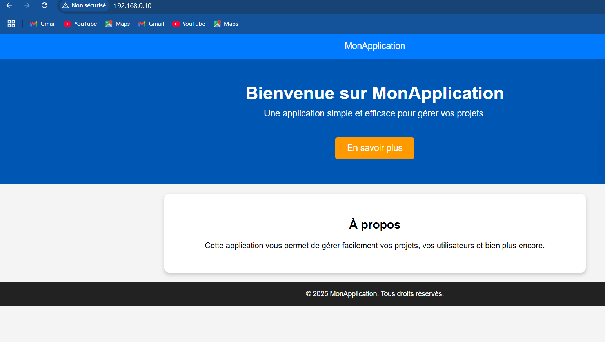

6. Installation de MySQL Server

```bash
sudo apt install mysql-server -y
```
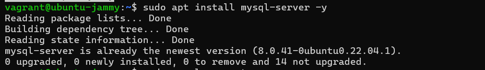

Se connecter à MySQL :

```bash
sudo mysql -u root
```
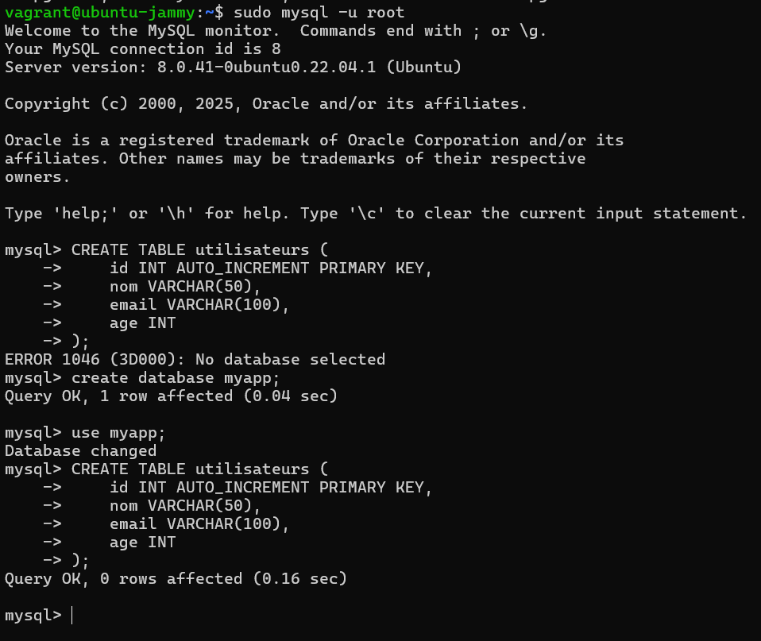
